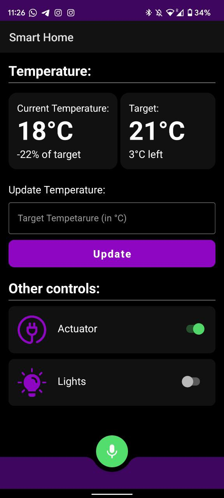

# SmartHome
SmartHome is an application that allows users to control their smart devices using vocal commands, making it easy and convenient to manage their smart home.
This application is part of a project, if you're looking for the MQTT server written in Python click [here](https://github.com/cristianlivella/SmartHomeServer)

    
    

## Features
- User-friendly interface that makes it easy to operate the smart home system
- Natural language processing capabilities that allow the application to understand and execute a range of vocal commands
- Communication with smart devices using the MQTT protocol, enabling remote control from any location
- Support for a variety of smart devices, including lights, appliances, and more

## Installation

1. Download the APK file from the releases tab of this repository
2. Transfer the APK file to your Android device
3. Open the APK file on your Android device to begin the installation process
4. Follow the on-screen instructions to complete the installation

## Usage
1. Open the application on your Android device
2. Follow the on-screen instructions to set up the application (note: the application requires access to the microphone)
3. Use the touch controls or vocal commands to operate your smart home

## Compatibility
Android devices running Android 8.0 and above.

## Dependencies
- <a href="https://github.com/eclipse/paho.mqtt.android"> PAHO MQTT Android </a>
- <a href="https://developer.android.com/reference/android/speech/SpeechRecognizer"> SpeechRecognizer </a>

## Development
SmartHome was developed using Java and the Android Studio IDE. To set up the development environment, you will need to install the following tools:

- Android Studio
- Android SDK
- MQTT library
- (optional) ADB tools
